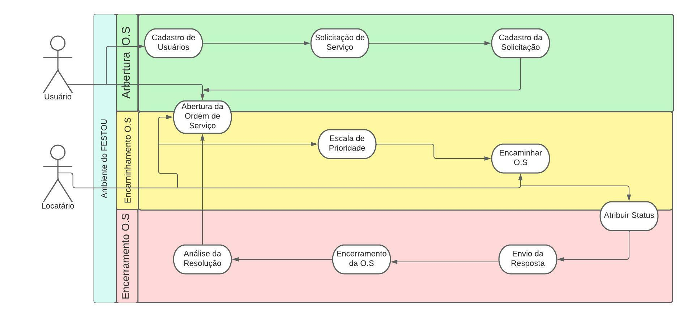

# Especificações do Projeto

Esse projeto tem como intenção o desenvolvimento dessa aplicação focando na necessidade de uma ferramenta que facilite a disponibilidade e o acesso a locais para festa que possam ser alugados. Pensando nisso, foram criadas as seguintes personas e histórias de usuário para colaborar com o escopo deste projeto.

## Personas

## Personas

|DESCRIÇÃO| MOTIVAÇÃO |FRUSTRAÇÃO|
|--------------------|------------------------------------|----------------------------------------|
|Lays (cerimonialista)| Encontrar locais com maior facilidade que combinem com as comemorações organizadas | Dificuldade em encontrar locais para locação.|
|Juliano (pai)| Encontrar um local ideal para festa da sua filha| Gasto desnecessário de tempo em locais que viu anunciados no jornal.|
|Marcela (noiva)| Encontrar um local para sua festa de casamento| Perde a informação de locais que encontrou devido a alta demanda de decisões a serem tomadas.|
|José (dono de salão)| Aumentar a visibilidade do seu salão | Não sabe aonde divulgar seu salão|

## Histórias de Usuários

|EU COMO... `PERSONA`| QUERO/PRECISO ... `FUNCIONALIDADE` |PARA ... `MOTIVO/VALOR`                 |
|--------------------|------------------------------------|----------------------------------------|
|Cerimonialista| Desejo encontrar com maior facilidade lugares para alugar| para melhorar a sua produtividade.|
|Pai| Desejo encontrar lugares que sejam seguros para crianças | Para me sentir tranquilo na festa.|
|Noiva| Desejo encontrar um local perfeito | Para um dia importante. |
|Dono de salão| Desejo divulgar meu salão| Para aumentar a visibilidade do meu lugar. |

## Requisitos

As tabelas que se seguem apresentam os requisitos funcionais e não funcionais que detalham o escopo do projeto. Para determinar a prioridade de requisitos, aplicar uma técnica de priorização de requisitos e detalhar como a técnica foi aplicada.

### Requisitos Funcionais

A tabela a seguir apresenta os requisitos do projeto, identificando a prioridade em que os mesmos devem ser entregues.

|ID    | Descrição do Requisito  | Prioridade |
|------|-----------------------------------------|----|
|RF-001| O sistema deverá permitir acesso aos dados cadastrais dos usuários. | ALTA | 
|RF-002| Abertura da ordem de serviço   | ALTA |
|RF-003| O sistema deverá permitir ao dono do salão a atribuição de escala de prioridade das demandas.   | ALTA |
|RF-004| O sistema deverá permitir o gerenciamento da agenda do dono do salão.  | ALTA |
|RF-005| O sistema deverá permitir a alteração de data pelo usuário.  | MÉDIA |
|RF-006| O sistema deverá permitir a emissão de um número de ordem de serviço ao qual vai se referir um relatório em sistema à parte.  | BAIXA |

### Requisitos não Funcionais

|ID     | Descrição do Requisito  |Prioridade |
|-------|-------------------------|----|
|RNF-001| O sistema deverá ser uma aplicação distribuída. |  MÉDIA |
|RNF-002| O  tempo de resposta das funcionalidades do sistema não deverá ultrapassar 6 segundos. |  BAIXA |
|RNF-003| O sistema deverá ser de fácil usabilidade. |  BAIXA | 

## Restrições

As questões que limitam a execução e que se configuram como obrigações claras para o desenvolvimento do projeto em questão são apresentadas na tabela a seguir:

|ID| Restrição                                             |
|--|-------------------------------------------------------|
|01| O projeto deverá ser entregue no final do semestre letivo, não podendo extrapolar a data de 14/12/2022 |
|02| A equipe não pode contratar um desenvolvedor para auxiliar no trabalho. |
|03| O aplicativo deve se restringir às tecnologias básicas de um Aplicação distribuída no Frontend/Backend dependendo do andamento do projeto. |

## Diagrama de Casos de Uso

O diagrama de casos de uso é o próximo passo após a elicitação de requisitos, que utiliza um modelo gráfico e uma tabela com as descrições sucintas dos casos de uso e dos atores. Ele contempla a fronteira do sistema e o detalhamento dos requisitos funcionais com a indicação dos atores, casos de uso e seus relacionamentos. 

# Matriz de Rastreabilidade

A matriz de rastreabilidade é uma ferramenta usada para facilitar a visualização dos relacionamento entre requisitos e outros artefatos ou objetos, permitindo a rastreabilidade entre os requisitos e os objetivos de negócio. 

|ID| Prioridade | Descrição | Tipo | Solicitante | Status | Data da Conclusão |                                     
|--|------------|------------|------|-------------|--------|------------------|
|01| Altíssima | Incluir/Excluir/Alterar informações de um local | Funcional | Equipe | Pendente | Não concluído |
|02| Altíssima | Incluir/Excluir/Alterar informações de um usuário | Funcional | Equipe | Pendente | Não concluído |
|03| Alta | Geração de um relatório do usuário interessado na alocação | Funcional | Equipe | Pendente | Não concluído |
|04| Média | Gerar relatório final a respeito do status de alocação de espaço | Funcional | Equipe | Pendente | Não concluído |
|05| Média | Tempo de acesso a Aplicação | Não Funcional | Equipe | Pendente | Não concluído |
|06| Alta | Ambiente de fácil uso | Não Funcional | Equipe | Pendente | Não concluído |
|07| Média | Proteção a erros de usuários | Não Funcional | Equipe | Pendente | Não concluído |
|08| Média | Estética da interface |Não Funcional | Equipe | Pendente | Não concluído |

# Gerenciamento de Projeto

De acordo com o PMBoK v6 as dez áreas que constituem os pilares para gerenciar projetos, e que caracterizam a multidisciplinaridade envolvida, são: Integração, Escopo, Cronograma (Tempo), Custos, Qualidade, Recursos, Comunicações, Riscos, Aquisições, Partes Interessadas. Para desenvolver projetos um profissional deve se preocupar em gerenciar todas essas dez áreas. Elas se complementam e se relacionam, de tal forma que não se deve apenas examinar uma área de forma estanque. É preciso considerar, por exemplo, que as áreas de Escopo, Cronograma e Custos estão muito relacionadas. Assim, se eu amplio o escopo de um projeto eu posso afetar seu cronograma e seus custos.

## Gerenciamento de Tempo

Com diagramas bem organizados que permitem gerenciar o tempo nos projetos, o gerente de projetos agenda e coordena tarefas dentro de um projeto para estimar o tempo necessário de conclusão.

### Cronograma do projeto 

### Gráfico de tempo

### Gerenciamento de equipe

## Gestão de Orçamento
O processo de determinar o orçamento do projeto é uma tarefa que depende, além dos produtos (saídas) dos processos anteriores do gerenciamento de custos, também de produtos oferecidos por outros processos de gerenciamento, como o escopo e o tempo.

### Orçamento do projeto

|Recursos| Quantidade | Valor Unitário R$ | Valor Total R$ |
|-------|-------------------------|----|---|
|Recursos Humanos| 3 | R$14.237,33 | R$42.712 |
|Hardware| 3 | R$1.000 | R$3.0000 |
|Rede/Internet| 3 | R$400 |  R$1.200 | 
|Energia | 3 | R$400 | R$1.200
|TOTAL| | | R$48.112

**Recursos Humanos:** 3 Pessoas x 712 horas x $20/hora = R$42.712

**Hardware:** Aluguel de 3 computadores durante 4 meses = 250 x 3 = 1000/pessoa x 3 = R$ 3.000

**Rede/Internet:** Serviço de internet R$100/mês x 3 pessoas = R$1.200

**Energia:** Serviço de energia R$100/mês x 3 pessoas = R$1.200
